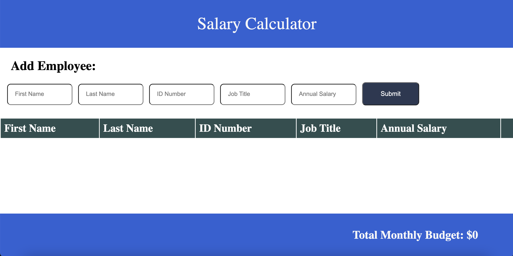

# Monthly Expenses Calculator

## Description

_Tier 2/Week7_

I was tasked with creating a salary calculator that collected and interpreted employee data.  On clicking the submit button, the app checks to confirm that all fields have been entered. If not, an error message is displayed on the DOM informing the user that all fields are required.  Upon receiving employee data, the app calculates the monthly portion of their annual salary and shows it at the bottom of the screen. If the company's monthly expenses exceed $20,000, that section of the app turns red. Employees can be added and deleted and all calculations update accordingly.

To see my repository, please visit: [GitHub Repository](https://github.com/sam-c-freeman/weekend-jquery-salary-calculato)

## Screen Shots

___
@import "Salary-Calculator-With-Data.png"
___
@import "Calculator-Over-Budget.png"

## Usage
Features:

1. Can enter employee data
2. App calculates an employee's monthly salary
3. Delete employees no longer on the payroll
4. Check to see if your monthly expenses exceed budget

## Built With

* HTML
* CSS
* Javascript
* JQuery

## Acknowledgement
Thanks to [Prime Digital Academy](www.primeacademy.io) who equipped and helped me to make this application a reality. 

## Support
If you have suggestions or issues, please email me at: <samcfreeman888@gmail.com>